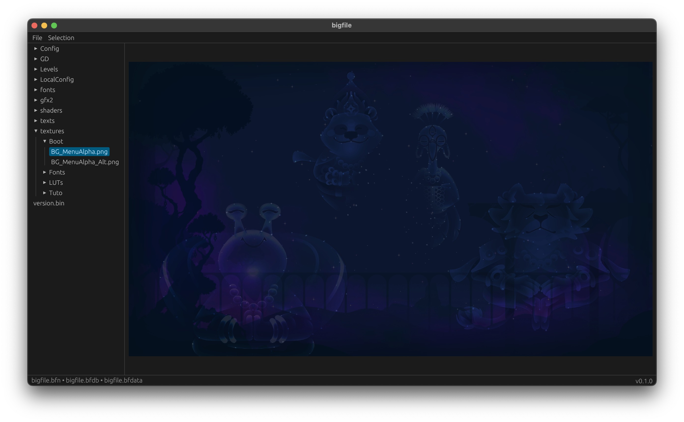

# 🤍 bigfile
**bigfile** is a tool for viewing *bigfiles*—files used for storing game assets in KarmaZoo (and possibly other games using the same engine, though I'm not aware of any)

## Usage
1. Click File —> Open or press <kbd>Ctrl</kbd> + <kbd>O</kbd>
2. Select bigfiles in order: `bigfile.bfn` —> `bigfile.bfdb` —> `bigfile.bfdata`
> [!TIP]
> For KarmaZoo, these are located in `%KarmaZoo%/resources/cookedData`, where `%KarmaZoo%` is your game installation directory
3. Extract selected files or extract all the files

## Building
To build both the lib and the app, simply clone the repo and run `cargo build`
